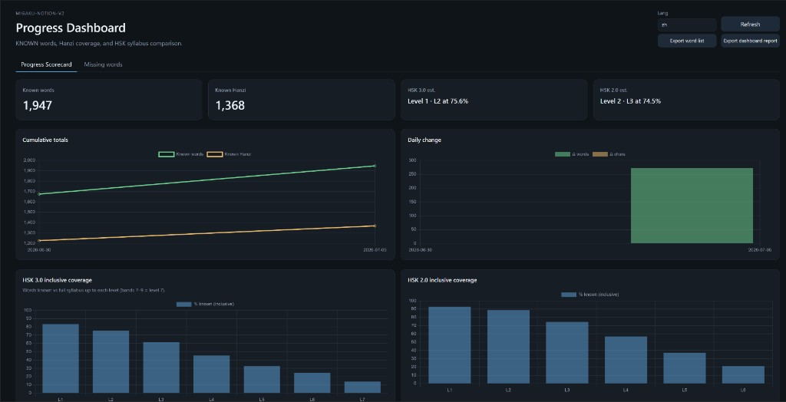
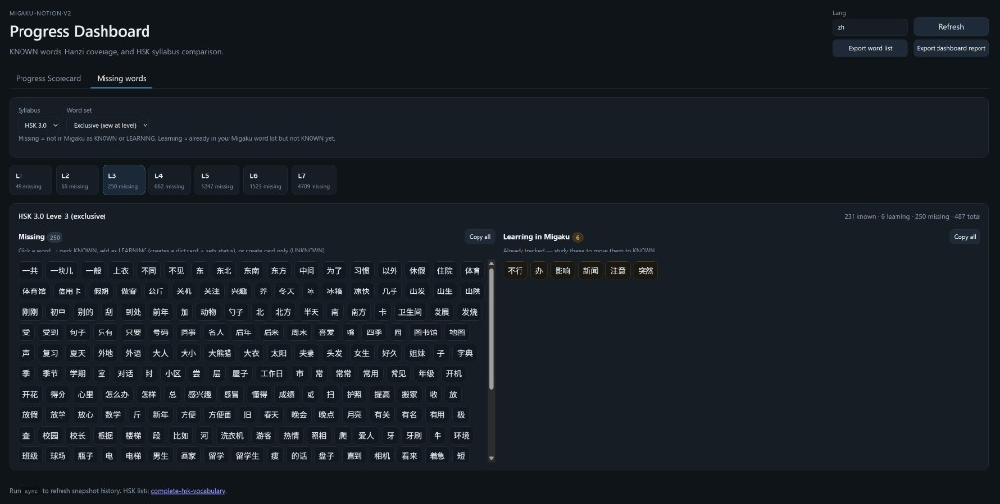

# migaku-notion-v2

Your Migaku word list, now supercharged with **Notion**, **spreadsheets**, and a **local progress dashboard**.

This is the successor to [migaku-notion](https://github.com/gfsincere/migaku-notion). Same idea (sync + cache + optional Notion mirror), but v2 talks to Migaku’s cloud sync directly, enriches from Migaku’s public dictionary data, tracks progress over time, compares you to HSK syllabi, and can **push words and cards back into Migaku**.

## What you get

- **Sync** — pull KNOWN / LEARNING words through the same `/pull-sync` path the app uses
- **Notion mirror (optional)** — upsert into a vocab database; Meaning column stays yours after the first fill
- **Local cache** — `state.db` so re-syncs only touch what changed
- **Dictionary enrichment** — pinyin, gloss hints, examples, frequency stars where available
- **Fail rates** — computed locally from your review history in the pull payload
- **Progress dashboard** — local web UI with charts, HSK level estimate, missing-word lists; mark words KNOWN / LEARNING or create dictionary cards straight from the browser
- **Export** — CSV / XLSX (Notion-shaped columns) from the CLI or the dashboard
- **Add cards** — import a word list (Notion page, database, or `--words`) and enqueue Migaku card creation with dict enrichment

## Install

You need **Python 3.11+** and a **Migaku account**. Notion is optional.

```powershell
git clone https://github.com/gfsincere/migaku-notion-v2.git
cd migaku-notion-v2
python -m venv .venv
.\.venv\Scripts\Activate.ps1
pip install -r requirements.txt
python -m migaku_notion setup
```

Linux / macOS: use `source .venv/bin/activate` instead of the Activate line.

`setup` walks you through Migaku login and (if you want it) Notion. It writes `.env` for you. Skip Notion entirely and use `sync --no-notion` later — everything still lands in `state.db`.

Copy `.env.example` → `.env` if you prefer to edit by hand.

## Daily use

**1. Sync** (after study, or whenever you want Notion / cache updated):

```powershell
python -m migaku_notion sync --lang zh --status KNOWN,LEARNING
```

Use `--dry-run` to preview. Use `--no-notion` if you only want the local cache.

**2. Dashboard** (progress, HSK gaps, push actions):

```powershell
python -m migaku_notion progress --serve
```

Open http://127.0.0.1:8765. The **Progress Scorecard** tab shows totals, growth charts, and HSK 2.0 / 3.0 coverage bars. The **Missing words** tab lists syllabus gaps by level — click a word to mark KNOWN, add as LEARNING (creates a dict card), or create a card only. **Export word list** and **Export dashboard report** (PDF via print) are in the header.





Each successful sync records a daily snapshot (known word count + unique known Hanzi) for the charts.

**3. Export for spreadsheets / AI / backup:**

```powershell
python -m migaku_notion export --csv vocab.csv --lang zh
python -m migaku_notion export --xlsx vocab.xlsx --lang zh
```

Same column layout as your Notion database. Feed CSV into whatever quiz generator you like — fail rates and status are included.

**4. HSK check from the terminal:**

```powershell
python -m migaku_notion hsk --lang zh
python -m migaku_notion hsk --gaps --level 2
```

**5. Bulk card creation from a word list:**

```powershell
python -m migaku_notion add-cards --words "你好,谢谢,再见" --apply
```

Or point at a Notion page / database of candidate words. Dry-run by default; add `--apply` when ready.

## Command cheat sheet

| Command | What it does |
|---------|----------------|
| `setup` | First-run wizard → `.env` |
| `login` | Refresh Migaku token |
| `status` | Quick sanity check |
| `sync` | Pull Migaku → cache (+ optional Notion) |
| `progress --serve` | Local dashboard |
| `hsk` | HSK 2.0 / 3.0 coverage + level estimate |
| `chars` | Unique Hanzi in your KNOWN (+ LEARNING) set |
| `export --csv` / `--xlsx` | Spreadsheet export |
| `add-cards` | Enqueue new Migaku cards from a list |
| `rebuild-cache` | Rebuild cache from Notion (one-time rescue) |

## Notion schema

Same properties as the original migaku-notion tool, plus **Frequency** and **Example**. `setup` creates the database or adds missing columns.

| Property | Notes |
|----------|--------|
| Word | Title — the hanzi / word |
| Pinyin / Pinyin (numeric) | From dict or pypinyin |
| Meaning | Yours — only auto-filled when blank on first v2 sync |
| Example, Frequency | From Migaku dict data |
| Status, Fail rate %, reviews | From Migaku |
| Migaku key, Sense # | Stable sync keys |

## Upgrading from migaku-notion v1

Copy `state.db` and `.env` from your old `migaku-notion/sync/` folder into this repo root. Swap Migoku vars for `MIGAKU_EMAIL` / `MIGAKU_PASSWORD` (or run `login`). Details: [MIGRATION-FROM-V1.md](./MIGRATION-FROM-V1.md).

## How it works (short version)

```
Migaku account → Firebase auth → GET /pull-sync (read)
                               → POST /push/enqueue (write status / cards)
         ↓
   migaku-notion-v2 + state.db + optional Notion
         ↓
   dashboard / CSV / XLSX / HSK reports
```

Dictionary files cache under `~/.migaku-notion-v2/dicts/`. HSK lists cache under `~/.migaku-notion-v2/hsk/`.

## Credits

- [khatibomar/migoku](https://github.com/khatibomar/migoku) — early reverse engineering
- [Migaku](https://migaku.com)
- [complete-hsk-vocabulary](https://github.com/drkameleon/complete-hsk-vocabulary) — HSK word lists
- [pypinyin](https://github.com/mozillazg/python-pinyin)

## Support

[](https://ko-fi.com/blacktonystark)

## License

MIT.
